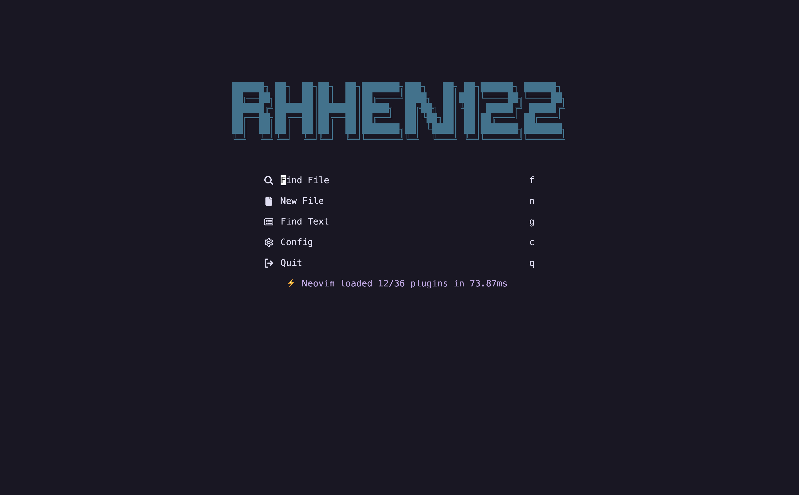
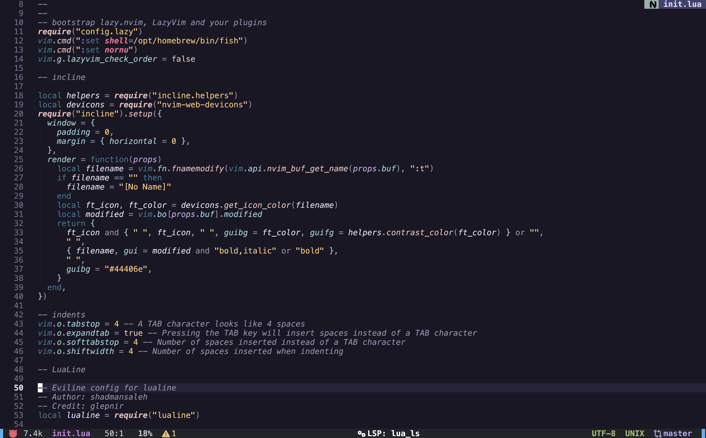

<div align="center">

# RhhenVim 🐍

RhhenVim is a custom LazyVim config that runs out of the box

</div>




## Install

```
mv ~/.config/nvim/ ~/.config/nvim-b/
rm -rf ~/.config/nvim/
git clone https://github.com/rhhen122/rhhenvim.git ~/.config/nvim/ ; nvim
```
